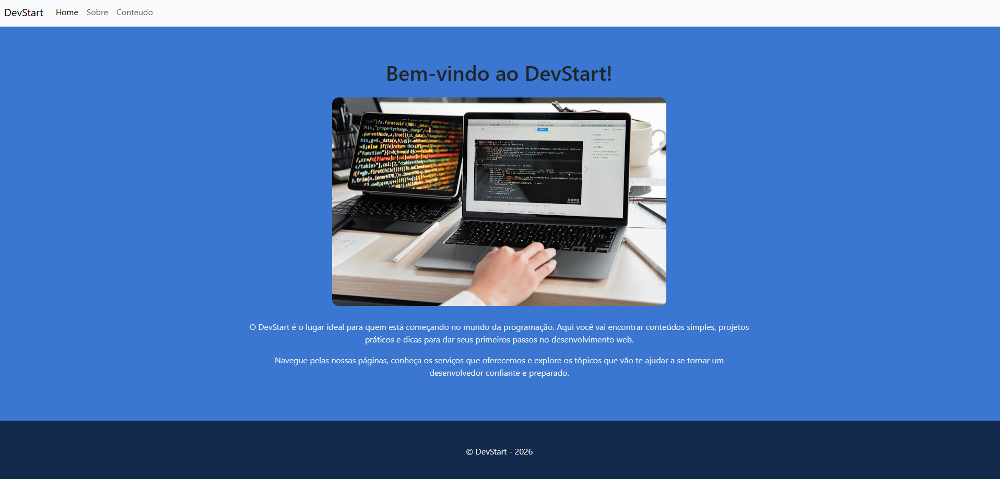

# DevStart

DevStart é um mini site simples feito em **Laravel**, criado para iniciantes que estão aprendendo desenvolvimento web.  
Ele serve como exemplo de como organizar páginas, layouts, CSS, e Blade, sem usar banco de dados ainda.

## Páginas do projeto
- **Home**: Apresentação do site
- **Sobre**: Sobre o projeto e mensagem para iniciantes
- **Conteúdos**: Conteúdos e dicas para estudar programação

## Tecnologias usadas
- PHP
- Laravel 
- Blade Templates
- CSS

## Como rodar
1. Clone o repositório
2. Instale dependências com `composer install`
3. Rode o servidor com `php artisan serve`
4. Acesse no navegador `http://127.0.0.1:8000`